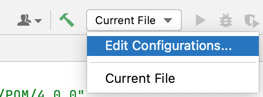
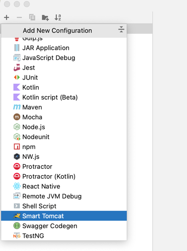
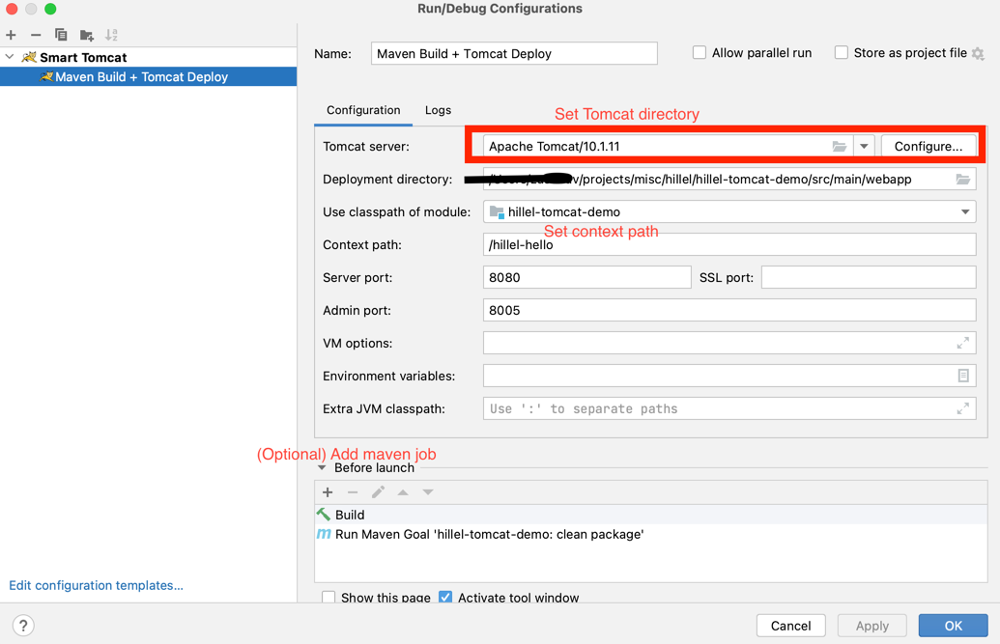

# Hillel Tomcat Demo + MealApp 

## Use [Postman Collection](./Servlets.postman_collection.json) to shoot requests on NameServlet

## App
### Java package  structure
```shell
ua.ithillel.tomcat
    ├── client            # External web service clients
    ├── dao               # Data access object classes
    ├── db                # Database utilities
    ├── exception         # Custom app exceptions
    ├── model             # Data model classes
    │   ├── dto           # Data transfer object classes - represent data from external client
    │   ├── entity        # Database entities - represent data stored in the DB
    │   ├── mapper        # Mapper classes - used to covert one model type into another
    │   └── vm            # View Models - represent data that is rendered on the UI
    ├── service           # service classes - Domain business logic of the app
    └── web               # Web UI classes: Servlets

```

### Build, deploy, run

#### Prerequisites
 - JDK v17
 - Tomcat v10.X
 - Maven

#### Maven Build
```mvn
  mvn clean package
```
#### Deploy artifact

 Move maven artifact `hillel-tomcat-demo-{VERSION}.war` from `target` into `webapp` directory of Tomcat

OR

Use Smart Tomcat Plugin
- Install `IntelliJ Idea > Preferences > Plugins`, search for `Smart Tomcat`
- Once installed you can create a start configuration


Choose `Smart Tomcat`


Create start config and save it


Hit play button to deploy and start the app on Tomcat

The app is now available via [http://localhost:8080/hillel-hello](http://localhost:8080/hillel-hello)

